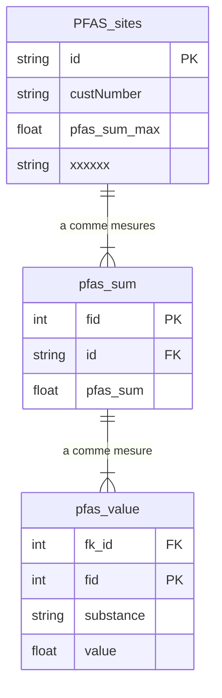

# ForEverPollution méthodologie


### Liens et ressources

Le projet : https://foreverpollution.eu/  
Article du monde présentant les résultats du projet : https://www.lemonde.fr/les-decodeurs/article/2023/02/23/revelations-sur-la-contamination-massive-de-l-europe-par-les-pfas-ces-polluants-eternels_6162940_4355770.html


### Pré-requis QGIS
La mise en oeuvre du traitement des données du  Forever pollution project nécessite l'utilisation des fonctionnalités suivantes:
- Gestionnaire de base de données
- Console Python
- Relations entre couches

### Données

Ici: https://lucmartinon.gitlab.io/ffp-data/  
Disponibles au format [CSV](https://fr.wikipedia.org/wiki/Comma-separated_values) et [parquet](https://fr.wikipedia.org/wiki/Apache_Parquet). Différence significative de taille: 375 Mo pour le CSV et 25 Mo pour le parquet.

On est parti pour le parquet!  
Un simple glissé/déposé dans QGIS permet une visualisation directe des données alphanumériques.  


#### Première analyse

- 337441 enregistrements
- 249531 enregistrement avec une valeur totale de PFAS >= 0
- 31137 enregistrements avec valeur totale de PFAS nulle mais identifié comme suspect
- 55665 enregistrements sans coordonnées de localisation
- pas de clé primaire
- plusieurs enregistrements pour un même point de mesure
- 2 champs contenant des données au format json

#### Traitement des données

- Créer une clé primaire
- Regrouper les points de mesure sur tous leurs champs communs.
- Récupérer la valeur maximum mesurée par point de mesure tout type de PFAS confondus.
- Créer la localisation géographique.

Tout cela est traité en une requête SQL dans le gestionnaire de base de données de QGIS:

```sql
SELECT 
    CAST(full.lon AS TEXT) || CAST(full.lat as TEXT) || COALESCE(full.name, '') AS id,
    full.category,
    full.lat,
    full.lon,
    full.name,
    full.city,
    full.country,
    full.type,
    full.sector,
    full.source_type,
    full.source_text,
    full.source_url,
    full.dataset_id,
    full.dataset_name,
    max(full.pfas_sum) as pfas_sum_max,
    full.matrix, 
    MakePoint(full.lon, full.lat, 4326) AS geom
FROM full 
WHERE full.pfas_sum >= 0 AND full.lat is not null AND full.lon is not null
GROUP BY 
    id,
    full.category,
    full.lat,
    full.lon,
    full.name,
    full.city,
    full.country,
    full.type,
    full.sector,
    full.source_type,
    full.source_text,
    full.source_url,
    full.dataset_id,
    full.dataset_name,
    full.matrix
```

On charge le résultat en tant que couche virtuelle, puis enregistrer ce résultat dans un geopackage.


#### Suspicion de contamination
Les enregistrements sans valeurs de PFAS mais avec suspicion de présence de PFAS sont isolés.
``` sql
SELECT * , MakePoint(full.lon, full.lat, 4326) AS geom 
FROM full
WHERE full.pfas_sum is null AND full.lat is not null AND full.lon is not null
```

Elles peuvent être chargées dans le geopackage créé à l'étape précédante.

#### Représentation cartographique

La valeur à représenter est le maximum de PFAS rencontré pour un point de mesure.La plage de valeurs s'étire de quelques centième de ng/l à 80000000 . Le choix d'une représentation par échelle logarithmique s'impose donc.  


Et voilà! Une carte dynamique à votre main vous permettant d'explorer tranquillement les données.


Mais ce n'est pas fini. Il faut rendre accessible toutes les valeurs mesurées sur un même point.  
On repart dans le gestionnaire de base de données pour une autre requête SQL, objectifs:
- Créer une clé primaire identique à celle créée sur la première requête
- récupérer les valeurs de PFAS

```sql
SELECT 
    CAST(full.lon AS TEXT) || CAST(full.lat as TEXT) || COALESCE(full.name, '') AS id,
    CAST(full.year as integer) as year, 
    full.date, 
    full.pfas_sum,
    full.pfas_values,
    full.details
FROM full 
where full.pfas_sum >= 0 and full.lat is not null and full.lon is not null
GROUP BY 
    id,
    full.year, 
    full.date, 
    full.pfas_values,
    full.details
```

On charge le résultat en tant que couche virtuelle, puis on enregistre ce résultat dans le geopackage existant.


Mise en place de la relation entre les tables *pfas_value* et *PFAS_sites*


Mais ce n'est pas fini! Le champ *pfas_value* au format json contient les données détaillées par substance. Nous allons les extraires pour créer une table spécifique. Pour ça rien de mieux qu'un petit script en Python. Il se lance à partir de la console Python de QGIS en ayant au préalable sélectionné dans la liste des couches la table *pfas_sum*.

```python
# -*- coding: utf-8 -*-
from qgis.core import QgsProject
import qgis.utils
import datetime
import os
import time
import json

def timing_decorator(func):
    def wrapper(*args, **kwargs):
        start_time = time.time()
        result = func(*args, **kwargs)
        end_time = time.time()
        elapsed = end_time - start_time
        final_time = str(datetime.timedelta(seconds = elapsed))
        print(f"Function {func.__name__} took {final_time} seconds to run.")

        return result
    return wrapper

class main():
    def __init__(self):
        process = ForEverProcess(qgis.utils.iface)
        process.iterate()

class ForEverProcess():
    def __init__(self, iface):
        self.iface = iface
        self.working_dir =  QgsProject.instance().readPath("./")
        self.layer = self.iface.layerTreeView().selectedLayers()[0]

    @timing_decorator

    def iterate(self):
        if self.layer:
            fields = self.layer.fields()

            # get the index of the field
            idx_pfas_values = fields.indexFromName('pfas_values')
            idx_fid = fields.indexFromName('fid')
            print(idx_fid)

            with open(os.path.join(self.working_dir, 'pfas_values.csv'), 'w', encoding="utf-8") as csv_file:
                csv_file.write('{0},{1},{2},{3},{4},{5},{6}\n'.format("fk_id", "cas_id", "unit","isomer", "substance", "less_than", "value"))

                feats = [feature for feature in self.layer.getFeatures()]
                for f in feats:
                    json_value = f[idx_pfas_values]
                    fid_value = f[idx_fid]
                    if json_value != '':
                        js = json.loads(json_value)

                        for l in js:
                            csv_file.write('{0},{1},{2},{3},{4},{5},{6}\n'.format(fid_value, l["cas_id"], l["unit"],l["isomer"], l["substance"], l["less_than"], l["value"]))

main()
```


Le fichier CSV résultat est ensuite chargé dans QGIS et exporté dans le geopackage contenant déjà les autres sources de données traitées.

Il ne reste plus qu'à créer une relation pour permettre d'afficher les valeurs par substance dans le sous-sous-formulaire des points de mesure.


> Point d'attention: compte-tenu du volume important de données, il est fortement conseillé de créer des index sur les champs utilisés dans les relations entre les 3 tables de la base.  

```sql
CREATE INDEX idx_pfas_sites_id ON PFAS_sites (id)
CREATE INDEX idx_pfas_values_fk_id ON pfas_values (fk_id)
CREATE INDEX idx_pfas_values_fid ON pfas_values (fid)
CREATE INDEX idx_pfas_sum_id ON pfas_sum (id)
```
Les valeurs chronologiques et par substance individuelle sont maintenant accessibles dans le formulaire d'interrogation des objets


**Schéma relationnel**

